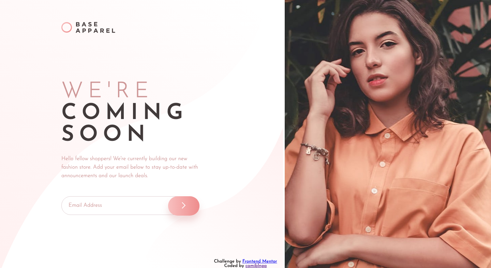
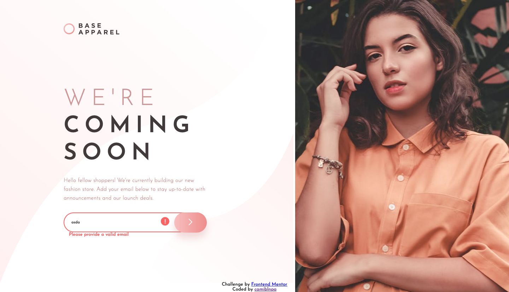
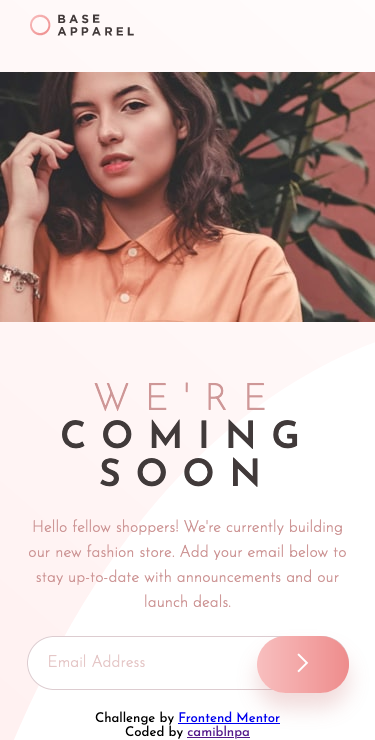

# Frontend Mentor - Base apparel coming soon

*This is the original design for desktop*

*And this is the original design for the active state*

*This is the original design for mobile*

## Where to find everything

In the `/images` folder you will find all the required assets for the project. The assets are already optimized.

There is also a `style-guide.md` file, which contains the information you'll need, such as color palette and fonts.
In the `index.html` you will find the HTML structure for this project, in the `styles.css` you will find all the styles for this challenge. And finally in the `function.js` you will find the function for the email validation.

## Sharing your solution

If you want to see my project click [This link](https://frontendmentor-base-apparel.vercel.app/). The project was deploy with [Vercel](https://vercel.com/). 

## My results

*This is my design for desktop*

*And this is my design with activate states*

*This is my design for mobile*

## Giving feedback

Feedback is always welcome!
